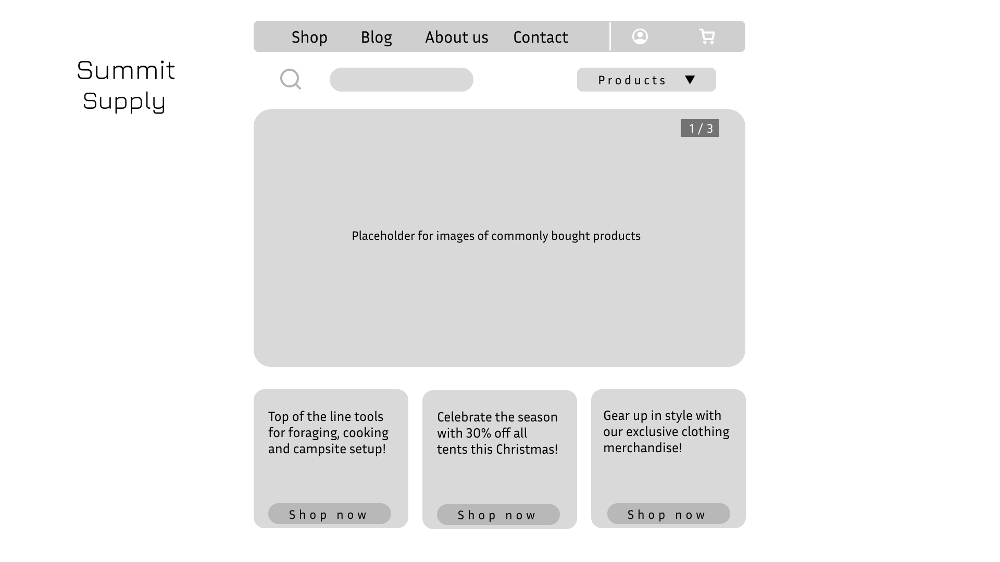
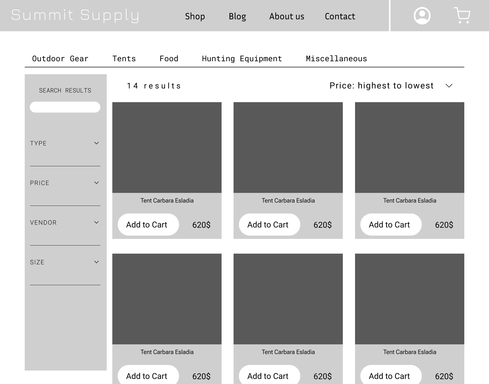
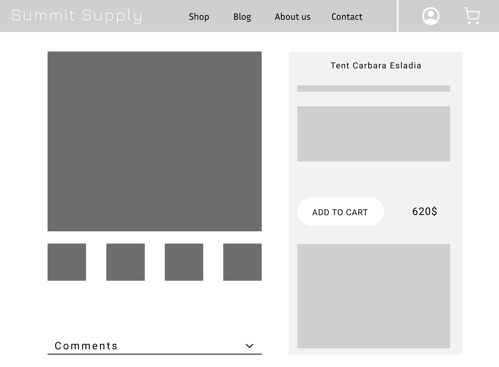
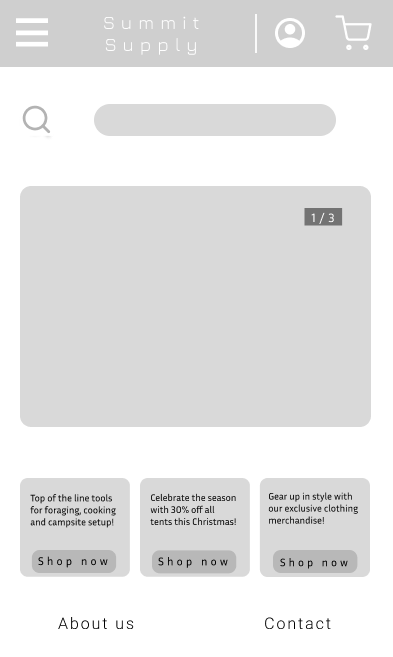
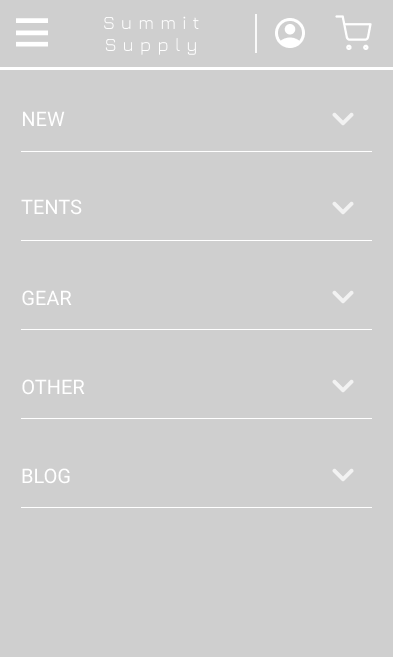
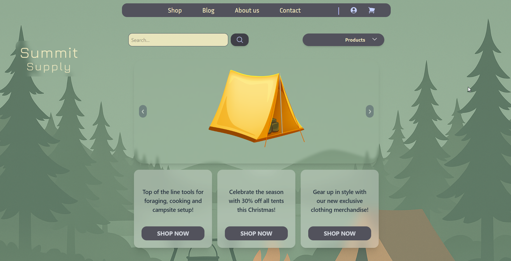
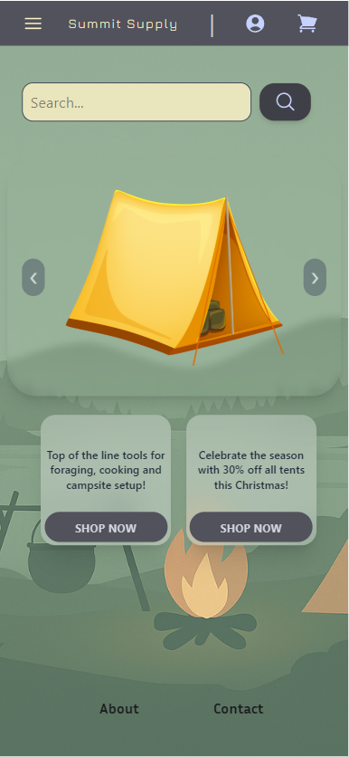
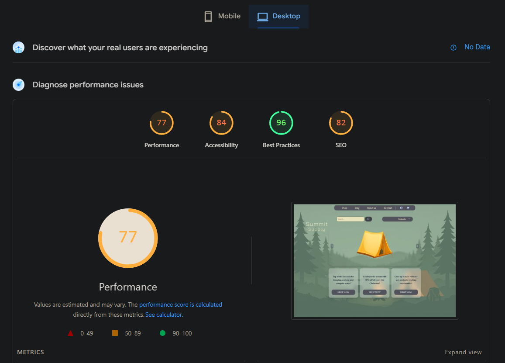
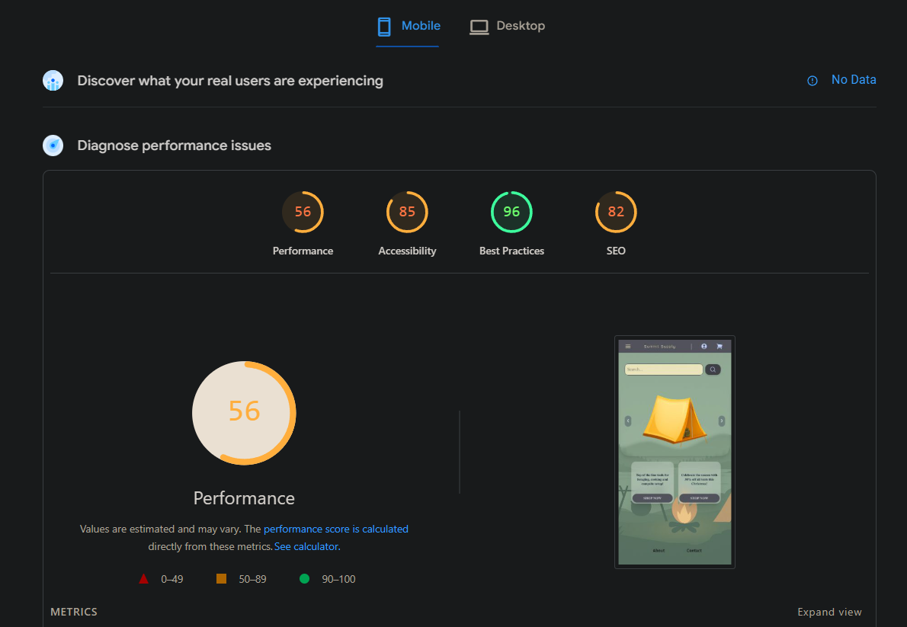

# Summit Supply

Hosted on Vercel.

Database hosted on Firebase, using realtime database solution.

## Low Fidelity mockups

Made with Figma.

### Desktop:

### Mobile:

## Final product:

Slight differences from the initial design, but overall good consistency.

### Desktop screenshot, deployed version:

### Mobile screenshot, deployed version:

## Metrics:

### Desktop results:

Performance seems to marginally suffer, likely due to usage of some outdated practices, and heavy realiance on data fetching from Firebase. Other metrics seem to be at an acceptable level.

### Mobile results:

Significant preformance drop when switching to mobile, other metrics are mostly unchanged.

## Summary:

Several UI and logic bugs present, difficult to eliminate. Performance and functionality have room for improvement. As a proof of concept for a webshop with a focus on UI design, the project is adequate. Harmonious color pallete, unique fonts, and adherence to CRAP principles makes the website appealing to potential customers.