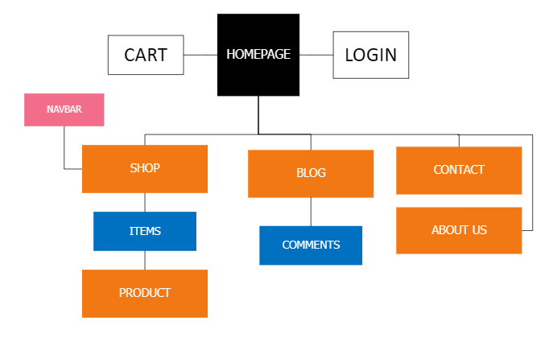
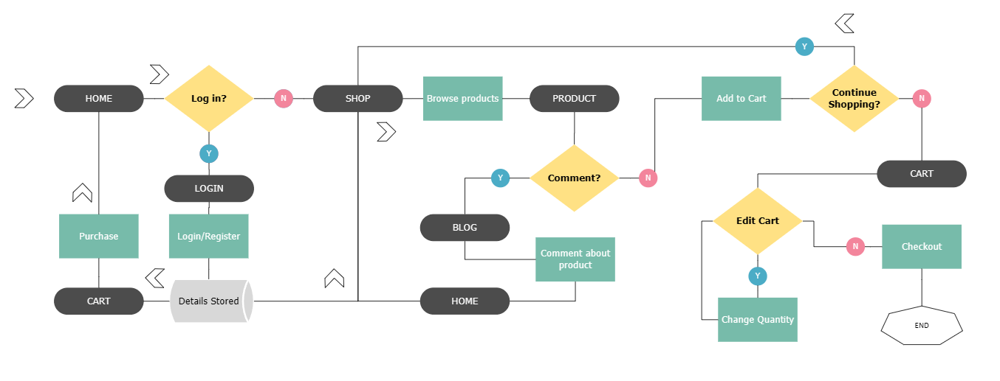
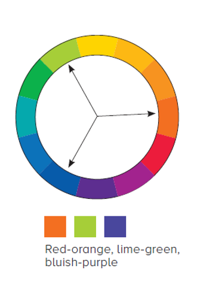

# Summit Supply

Hosted on Vercel.

Database hosted on Firebase, using realtime database solution.

## Low Fidelity mockups

Made with Figma.

### Desktop:

### Mobile:

## Final product:

Slight differences from the initial design, but overall good consistency.

### Desktop screenshot, deployed version:

### Mobile screenshot, deployed version:

## Information architecture:

### Sitemap

### Website navigation flowchart

## CRAP Principles

### Contrast

Contrasting three-part color pallete used, desaturated lime for background, wide spectrum of amber for foreground, indigo for accent, zinc(gray) for navbar and buttons.

### Repetition

Reused navbar, button style, item list layout in shop page, ect.

### Alignment

Inverted pyramid layout that settles into straight alignment in hero page, all pages uses generous horizontal padding for content with the exception of the navbar, ect.

### Proximity

Item list, Cart, home page boxes, navbar links, ect.

## Metrics:

### Desktop results:

Performance seems to marginally suffer, likely due to usage of some outdated practices, and heavy realiance on data fetching from Firebase. Other metrics seem to be at an acceptable level.

### Mobile results:

Significant preformance drop when switching to mobile, other metrics are mostly unchanged.

## Summary:

Several UI and logic bugs present, difficult to eliminate. Performance and functionality have room for improvement. As a proof of concept for a webshop with a focus on UI design, the project is adequate. Harmonious color pallete, unique fonts, and adherence to CRAP principles makes the website appealing to potential customers.